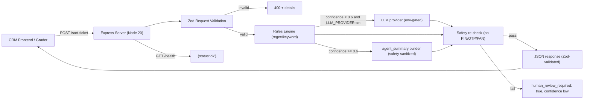
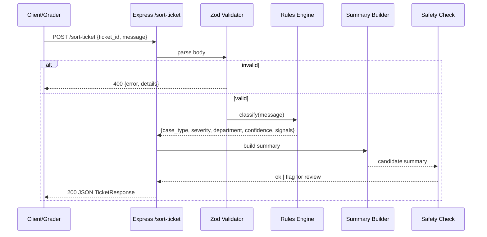

# SUST CRM Triage API

A deterministic, rules-based **Node.js (Express)** HTTP service implementing
`GET /health` and `POST /sort-ticket` for the **SUST CSE Carnival 2026
QueueStorm** mock round. Classifies a CRM ticket into `case_type`,
`severity`, `department`, `agent_summary`, `human_review_required`, and
`confidence` — all without GPU or secrets.

> Deployment is intentionally deferred per the latest plan revision. The
> service is fully runnable locally; see the "Run" section.

## Architecture





## Endpoints

| Method | Path           | Purpose                                        |
| ------ | -------------- | ---------------------------------------------- |
| GET    | `/health`      | Liveness probe — returns `{ "status": "ok" }`. |
| POST   | `/sort-ticket` | Classify a CRM ticket.                         |

### `POST /sort-ticket`

Request body:

```json
{ "ticket_id": "T-1", "channel": "app", "locale": "en-BD", "message": "..." }
```

Response body (200):

```json
{
  "ticket_id": "T-1",
  "case_type": "phishing_or_social_engineering",
  "severity": "critical",
  "department": "fraud_risk",
  "agent_summary": "The message appears to describe a social-engineering or phishing attempt asking for sensitive credentials. Severity is critical; this case should be handled with the highest urgency. Route to the fraud and risk team for immediate review.",
  "human_review_required": true,
  "confidence": 0.95
}
```

Error responses:

- `400 invalid_request` — body failed Zod validation (`details[]` lists path+message).
- `413 payload_too_large` — body > 16 KB.
- `500 internal_error` — unexpected failure.
- `504 timeout` — handler exceeded the 25 s budget.

### Safety contract

`agent_summary` will **never** echo or request `PIN`, `OTP`, `PAN`, `CVV`,
`password`, or `passcode`. Long digit runs (4+ digits) are redacted as
`[redacted]`. If a safety issue is detected, `human_review_required` is
forced to `true` and `confidence` is clamped low.

## Environment

Copy `.env.example` to `.env` and adjust. The service runs with **no
secrets** by default.

| Variable        | Required | Default  | Notes                                                    |
| --------------- | -------- | -------- | -------------------------------------------------------- |
| `PORT`          | no       | `3000`   | HTTP listen port.                                        |
| `NODE_ENV`      | no       | -        | Standard.                                                |
| `LOG_LEVEL`     | no       | `info`   | pino log level.                                          |
| `LLM_PROVIDER`  | no       | unset    | `openai`, `groq`, or `google`; enables the optional LLM fallback. |
| `LLM_API_KEY`   | no       | unset    | Required only when `LLM_PROVIDER` is set.                |
| `LLM_MODEL`     | no       | unset    | Required only when `LLM_PROVIDER` is set.                |
| `LLM_BASE_URL`  | no       | provider | Override the provider base URL (e.g. a proxy).           |

## Run

The backend lives in `backend/`. Run all commands from there unless
otherwise noted.

```bash
cd backend
npm install
npm start                 # production: node src/server.js
npm run dev               # nodemon
npm test                  # vitest run (5 public cases + supertest)
npm run eval              # replays the 5 public cases, exits non-zero on mismatch
```

Server boots on `http://localhost:3000`.

### Sample curl

```bash
# Health
curl http://localhost:3000/health

# Phishing
curl -X POST http://localhost:3000/sort-ticket \
  -H 'Content-Type: application/json' \
  -d '{"ticket_id":"T-1","message":"Someone is asking for my OTP over the phone and says they are from bKash. Is that bKash?"}'

# Wrong transfer
curl -X POST http://localhost:3000/sort-ticket \
  -H 'Content-Type: application/json' \
  -d '{"ticket_id":"T-2","message":"I sent 7000 taka to the wrong number by mistake, please help me get it back."}'

# Payment failed
curl -X POST http://localhost:3000/sort-ticket \
  -H 'Content-Type: application/json' \
  -d '{"ticket_id":"T-3","message":"My payment failed but the amount was deducted from my account."}'

# Refund
curl -X POST http://localhost:3000/sort-ticket \
  -H 'Content-Type: application/json' \
  -d '{"ticket_id":"T-4","message":"I want a refund for my last order, the product never arrived and I want my money back."}'

# Other
curl -X POST http://localhost:3000/sort-ticket \
  -H 'Content-Type: application/json' \
  -d '{"ticket_id":"T-5","message":"How do I change the language of the app to Bangla?"}'
```

## Project layout

```
Convergence_Mock_SUST/
├── README.md
├── .gitignore
└── backend/                # Express triage API (see "Run")
│   ├── package.json
│   ├── .env / .env.example
│   ├── .dockerignore
│   ├── src/
│   │   ├── server.js           # process entrypoint
│   │   ├── app.js              # Express wiring
│   │   ├── lib/
│   │   │   ├── logger.js       # pino logger
│   │   │   ├── safety.js       # secret detector + sanitizer
│   │   │   └── sampleCases.js  # the 5 public tickets + expectations
│   │   ├── schemas/
│   │   │   └── ticket.js       # Zod request/response + enums
│   │   ├── classify/
│   │   │   ├── rules.js        # layered rules engine
│   │   │   ├── summary.js      # agent_summary template builder
│   │   │   └── llm.js          # env-gated optional LLM fallback
│   │   └── routes/
│   │       └── sortTicket.js   # POST /sort-ticket handler
│   ├── tests/
│   │   ├── classify.test.js    # unit tests for rules engine
│   │   └── server.test.js      # supertest schema + safety + 5 public cases
│   └── scripts/
│       └── eval.js             # replays 5 public cases, prints table
└── frontend/               # React + Vite client (see "Frontend")
    ├── package.json
    ├── vite.config.js
    ├── index.html
    └── src/
        ├── App.jsx
        ├── main.jsx
        ├── styles.css
        ├── api/triage.js
        ├── components/
        │   ├── TicketForm.jsx
        │   ├── ResponseCard.jsx
        │   └── SeverityChip.jsx
        └── data/samples.js
```

## Frontend

A small React + Vite client lives in [`frontend/`](frontend/). It posts
tickets to `POST /sort-ticket` and renders the full classification
response (case type, severity, department, summary, `human_review_required`,
confidence) as a routing card. There is also a "Try a sample" dropdown
that fills the form with the same five public cases used by the backend
`npm run eval` script.

### Run the frontend

You need two terminals: one for the API, one for the dev server.

```bash
# Terminal 1 — backend on http://localhost:3000
cd backend
npm install
npm start

# Terminal 2 — frontend on http://localhost:5173
cd frontend
npm install
npm run dev
```

The Vite dev server proxies `/api/*` to `http://localhost:3000`, so the
React app can call `fetch('/api/sort-ticket')` without CORS issues. To
point the client at a different API origin (e.g. a deployed backend),
copy `frontend/.env.example` to `frontend/.env` and set `VITE_API_BASE`,
then rebuild.

### Frontend scripts

```bash
cd frontend
npm run dev      # Vite dev server with hot reload
npm run build    # production build to frontend/dist
npm run preview  # serve the production build locally
```

## Submission checklist (Google Form)

- [ ] Team name
- [ ] GitHub URL — public repo
- [ ] Live API URL — *deferred* (deployment not in this revision)
- [ ] Platform — *deferred*
- [ ] LLM used? (Yes/No + provider) — defaults to **No**; set `LLM_PROVIDER` to enable
- [ ] Local runbook — `cd backend && npm install && npm start`, then `npm test && npm run eval`
- [ ] Blockers / notes — deployment intentionally deferred

## License

Internal project, SUST CSE Carnival 2026 mock round.